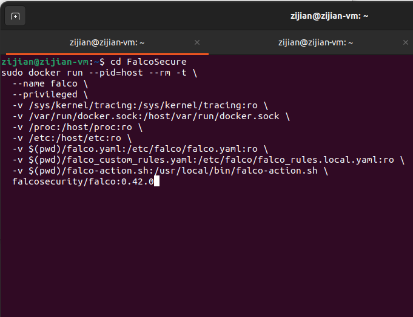
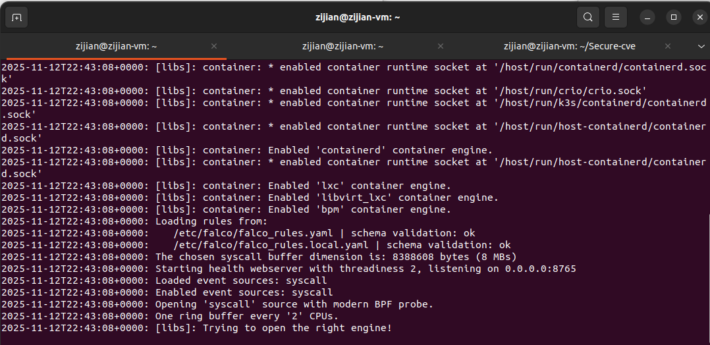
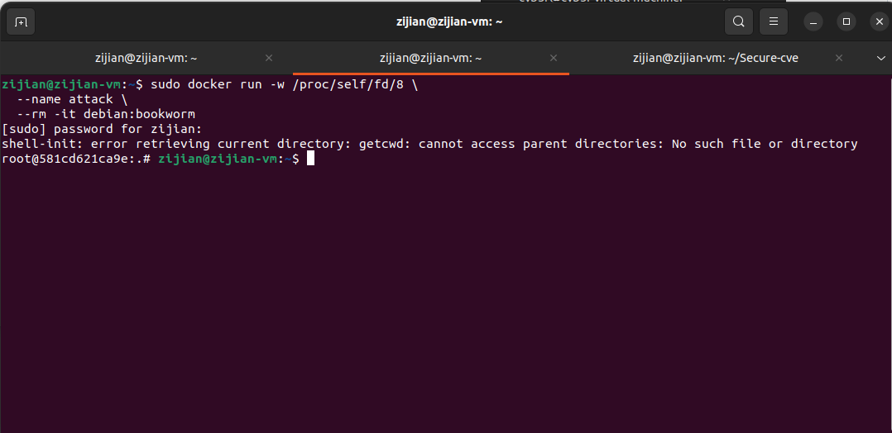
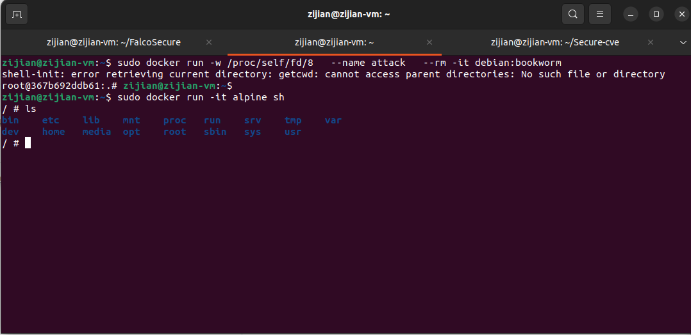
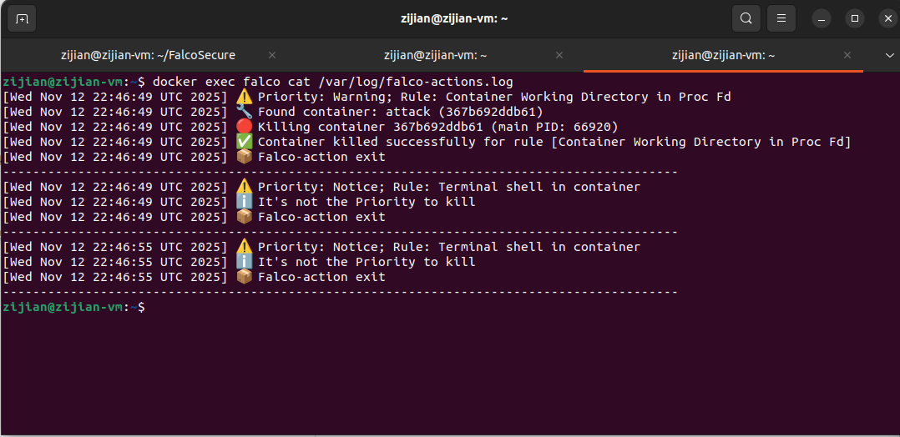
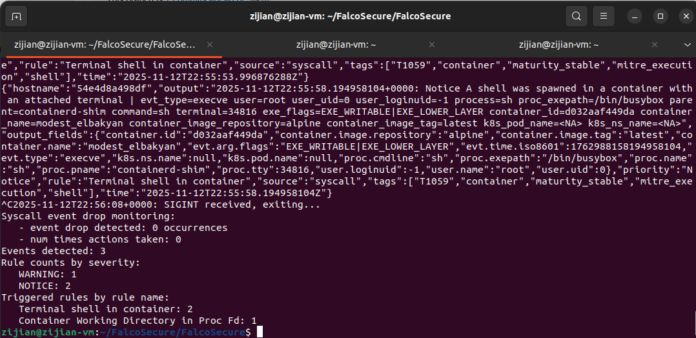

# INSE 6130 — Falco security application


---


## Install Debian .deb files (from Branch CVE-2024-21626 Replication)

Open a terminal and run:

```bash
cd /debian
sudo dpkg -i \
  ./containerd.io_1.6.4-1_amd64.deb \
  ./docker-ce_24.0.6-1~ubuntu.22.04~jammy_amd64.deb \
  ./docker-ce-cli_24.0.6-1~ubuntu.22.04~jammy_amd64.deb \
  ./docker-buildx-plugin_0.10.2-1~ubuntu.22.04~jammy_amd64.deb
```

---


## Run the falco container

Start a falco container with a pseudo-terminal and privilege power with host's PID namespace. Also mounting sensitive directories for monitoring and custom files for configuration to kill containers.

```bash
cd FalcoSecure
sudo docker run --pid=host --rm -t \
  --name falco \
  --privileged \
  -v /sys/kernel/tracing:/sys/kernel/tracing:ro \
  -v /var/run/docker.sock:/host/var/run/docker.sock \
  -v /proc:/host/proc:ro \
  -v /etc:/host/etc:ro \
  -v $(pwd)/falco.yaml:/etc/falco/falco.yaml:ro \
  -v $(pwd)/falco_custom_rules.yaml:/etc/falco/falco_rules.local.yaml:ro \
  -v $(pwd)/falco-action.sh:/usr/local/bin/falco-action.sh \
  falcosecurity/falco:0.42.0
```
 
 
Below are screenshots showing the falco container/session for reference.
 


Now the falco is monitoring the system


 
---
 
## Run the CVE-2024-21626 container
 
In a new window of termial, start a Debian Bookworm container with an interactive shell and a custom working directory:

```bash
sudo docker run -w /proc/self/fd/8 \
  --name attack \
  --rm -it debian:bookworm
```

Below are normal screenshots showing the container/session for reference.
 


 
Below are screenshots with falco container runnnig showing the malicious container is killed automatically.

 


---

## Run the Control variable test container

In the same terminal, Start a normal alpine container with an interactive shell

```bash
sudo docker run -it alpine sh
```
Here is the screenshot shows it runs




## See the logs from falco-action.sh
Start a new window of terminal

```bash
docker exec falco cat /var/log/falco-actions.log
```

Here is the screenshot of the log




Go back to the first terminal window and press CTRL+C, we exitting the falco container with logs that show the stats of detected event.


---
