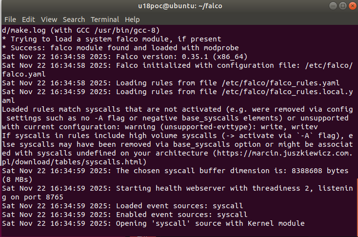
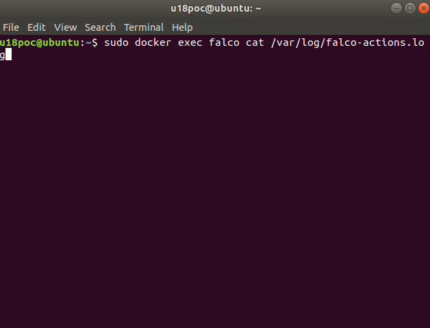
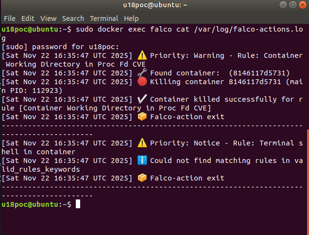
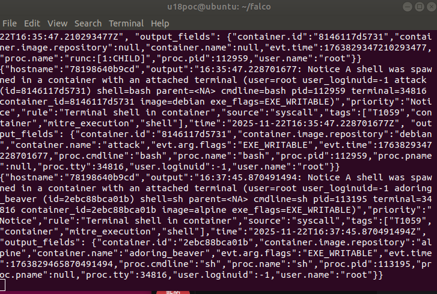
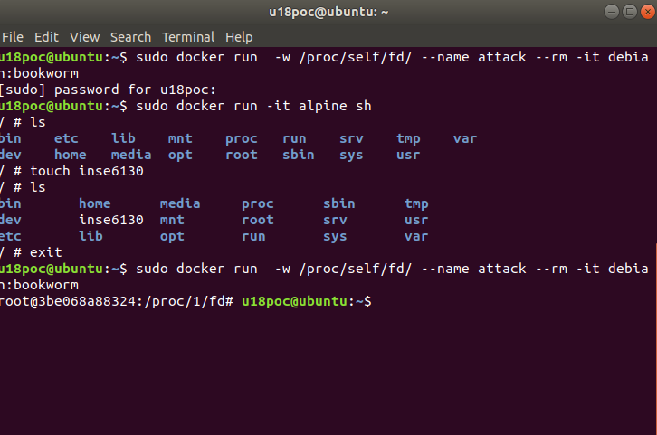

# INSE 6130

This branch is for the falco container set up on ubuntu 18.04

Becuase the version of ubuntu 18.04 and kernel version, we are using kernel modedule instead of eBPF Probe and mordern eBPF.


---

## Falco setup

For ubuntu 18.04, we will use falco 0.35.1. Here is the command to set up the environment. It's easier to install the falco locally, then installation will set up the environment for us. We add the repository and the list.

```
curl -fsSL https://falco.org/repo/falcosecurity-packages.asc | \
  sudo gpg --dearmor -o /usr/share/keyrings/falco-archive-keyring.gpg
```
```
echo "deb [signed-by=/usr/share/keyrings/falco-archive-keyring.gpg] https://download.falco.org/packages/deb stable main" | \
  sudo tee /etc/apt/sources.list.d/falcosecurity.list
```
install falco 0.35.1
```
sudo apt-get update
sudo apt-get install -y falco=0.35.1 
```
Then use the kernel module
```
sudo falco-driver-loader module
```
For my custom program to work, we need to give the right to excute it, using chmod in the folder contains "falco-action.sh":
```
chmod +x $(pwd)/falco-action.sh
```
---
## Runnig Falco

Move to the folder that contains falco configs, my custum rule, and my custum .sh program
```
cd falco
```

Then here is the command to run the container for the falco:
```
sudo docker run --pid=host --rm -it   --name falco   --privileged -v /sys/kernel/tracing:/sys/kernel/tracing:ro  -v /dev:/host/dev -v /var/run/docker.sock:/host/var/run/docker.sock -v /proc:/host/proc:ro -v /etc:/host/etc:ro   -v /lib/modules:/host/lib/modules:ro -v $(pwd)/falco.yaml:/etc/falco/falco.yaml:ro -v $(pwd)/falco_custom_rules.yaml:/etc/falco/falco_rules.local.yaml:ro -v $(pwd)/falco-action.sh:/usr/local/bin/falco-action.sh falcosecurity/falco:0.35.1 
```
Here is a screenshot of command in terminal:


Run it, then we will see falco starts to monitor:



Then we open another terminal to run a CVE container:
(if in wrong runC, just delete the 8, falco will still detect it.)
```
sudo docker run  -w /proc/self/fd/8 --name attack --rm -it debian:bookworm
```


Then we can see that the falco detects the action:


Then we can see that the CVE container gets killed right after falco detection.


Here is a command to see the custom program's log:
```
sudo docker exec falco cat /var/log/falco-actions.log
```


In the screenshot below we cn see the colorful logs I set up (way better than reading json logs)



Now with the command to run a variable control container with alpine:
```
sudo docker run -it alpine sh
```


We can see that the falco catch the action of this container spawning a shell:



But as the screenshot shows, the normal container can work normally without restriction:


Exit the normal container, again, try to run the run the CVE container, it gets killed right away:



---
